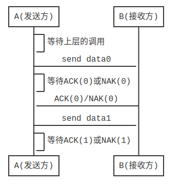

# 计算机网络 第三章 传输层

## 一、概念理解

运输层最重要的两个协议就是TCP和UDP协议。

TCP是在不可靠的IP协议上实现的可靠传输协议。

UDP仅仅是在IP协议上增加了一点多路复用、多路分解服务，并不保证数据包的到达，是不可靠传输协议。

运输层的一个很重要的功能是复用和分解:

- 多路复用：为每个数据块封装上首部信息从而生成报文段，将信息传递到网络层。
- 多路分解：将运输层报文段中的数据交付到正确的套接字。

为了解决复用和分用过程中数据不混淆的问题, 运输层采用`协议端口号(或端口)`来区分.在TCP/IP体系中, 运输层采用16位(共65535个)的端口号来标识一个端口. 端口只是具有本地意义, 表示了应用程序和运输层交互时使用的标识.

不同计算机的两个应用程序通信时,需要获取对方的IP地址(知道对方在哪),和对方程序的端口(找到对方的程序入口).就像我们寄信时,要写上地址(IP地址)和收件人(端口)一样.

上图中，从上往下（进程到运输层）是多路复用，从下往上（运输层到单个进程）是多路分解。

## 二、UDP协议

UDP协议只是做了运输层协议能够做的最少工作。DNS解析就是UDP协议使用的一个经典场景。

UDP特点：

- （1）无连接的：发送数据之前不需要建立连接，减少了开销和发送数据之前的时延。

- （2）尽最大努力交付：不保证可靠的交付，主机不需要维持复杂的链接状态表。

- （3）面向报文的：发送方的UDP对应用程序交下来的报文，在添加首部后就向下交付给IP层。既不拆分，也不合并，而是保留这些报文的边界，因此，应用程序需要选择合适的报文大小。

- （4）没有拥塞控制。

- （5）支持一对一、多对一和多对多的交互通信。

- （6）首部开销小，只有8个字节 

UDP报文结构

UDP一般用在网络电话、实时视频会议、流式存储音频与视频等实时性比较强的应用上面，因为这些应用都能容忍少量的分组丢失，可靠的数据传输并不是至关重要的。

UDP在多路分解中只根据目的ip和端口号解析到对应的socket。

## 三、TCP协议

IP协议是不可靠的，TCP协议是在传输层来保证数据的可靠传递。这里将一步步来解析TCP是如何做到的，我们分以下几个步骤来看：

- 1、默认网络层提供的传输信道是可靠的
- 2、传输过程中有比特差错
- 3、传输工程中NAK受损
- 4、不发送NAK，只发送ACK
- 5、传输过程总有丢包

以上步骤我们一步步来看，不理解可以慢慢来。

**（1）网络层提供可靠传输信道**

最简单的情况下传输模式就很简单了，直接发送就好了。

**（2）可靠的信道会有比特差错**

这时候我们没法知道我们接收方B是否收到完整的信息，只能通过B回应一个消息告诉A才可以：

当收到`ACK(OK)`时候就说明收到完整信息，当收到`NAK(NO)`时候就说明没收到完整信息，那么就得重新发送。

**（3）传输过程中NAK受损**

传输过程中NAK受损的话，A就不知道B没有收到上一块发送的数据，那A就会一直等待。

为解决这个问题，是在数据分组中添加一新字段，让发送方对其数据进行分组编号，然后将发送数据的分组序号放在该字段，于是接收方只需要检查序号即可确认收到的分组是否一次重传。

如上所示，发送方A先发送数据分组0，接收到了ACK(0)，则继续发送数据分组2。如果接收到了NAK(0)，则重新发送分组0。

**（4）不发送NAK**

如果不发送NAK，而是对上一次正确接收的分组发送一个ACK，我们也能实现与NAK一样的效果。发送方接收到对同一个分组的两个ACK后，就知道接收方没有正确接收到跟在被确认两次的分组后面的分组。

步骤4和步骤3的细微变化在于，接收方此时必须包括由一个ACK报文所确认的分组序号，发送方此时必须检查接收到的ACK报文中被确认的分组序号。

**（5）传输过程中有丢包**

上面我们都是假设只有比特受损，没有丢包的问题。现在我们出现丢包的问题了，这个问题并不罕见。

这里我们让发送方负责检测和恢复丢包工作。假定发送方传输一个数据分组，会出现发送的分组丢失，或者接收方回应的ACK丢失。在这两种情况下，发送方都收不到应当到来的接收方的响应。那如果发送方愿意等待足够长的时间以便确认分组已丢失，则它只需要重传该数据分组即可。

这里我们分别来看几种情况：

至此我们算是完成了一个可靠的传输协议！

