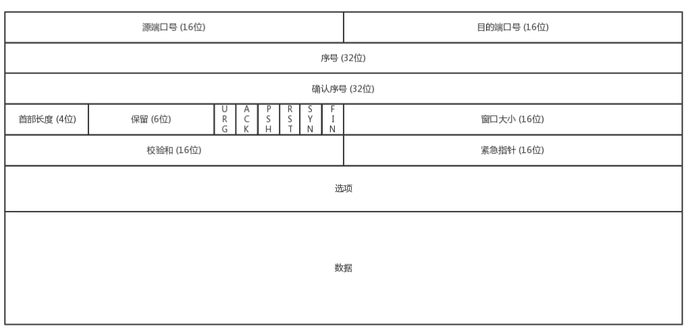
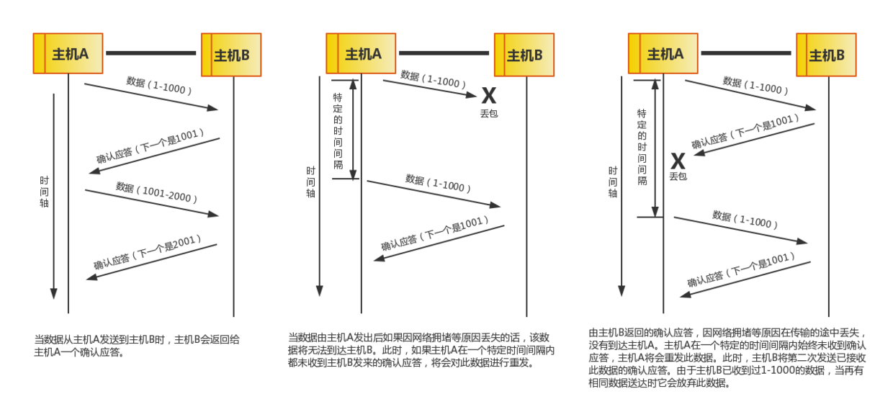
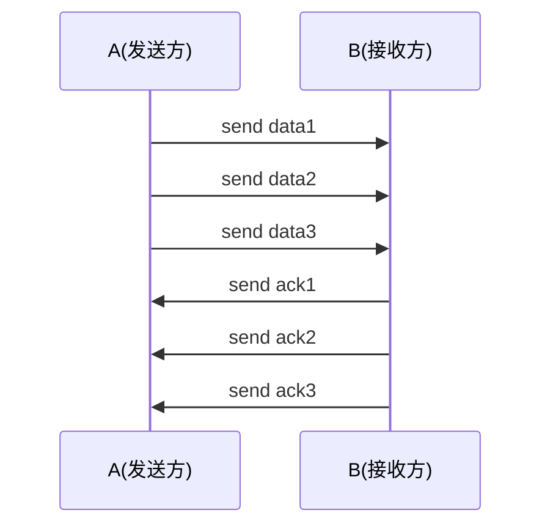
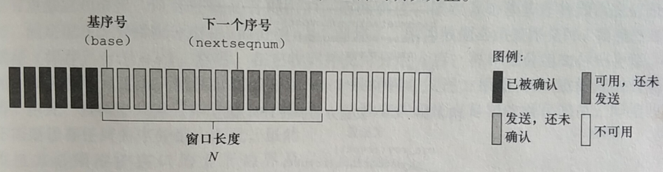
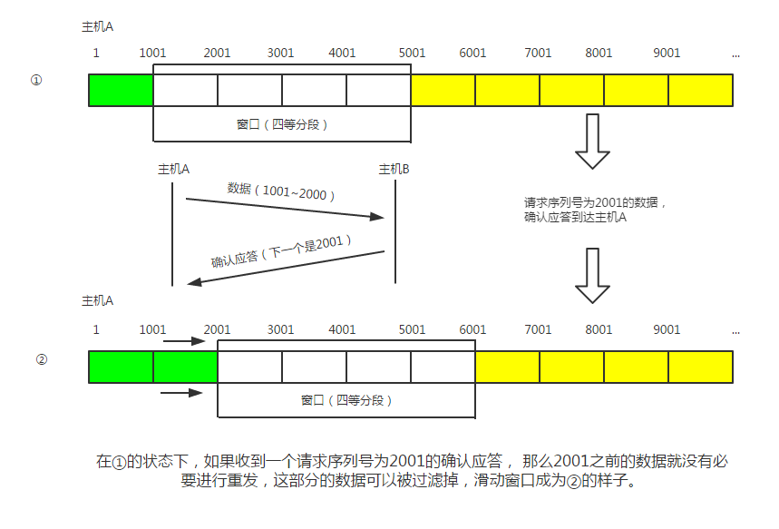
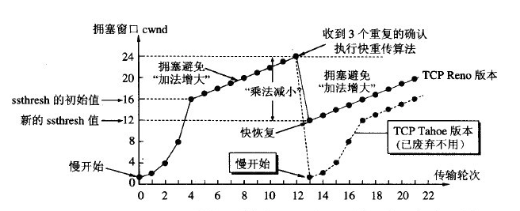

# 计算机网络-第三章-传输层2


## 面向连接运输：TCP

TCP的报文结构如下所示：



源端口号、目的端口号这个不用多说，肯定是必须的。

序号是对应数据包的序号，解决乱序问题的，不然怎么知道哪个数据包在前哪个在后呢。

确认号是确认发送的包有没有正确接收的，比如确认号45，则说明45序号之前的包都已经收到。

随后便是一些状态字段，例如 SYN 是发起一个连接，ACK 是回复，RST 是重新连接，FIN 是结束连接等。TCP 是面向连接的，因而双方要维护连接的状态，这些带状态位的包的发送，会引起双方的状态变更。


TCP通过序列号与确认应答提高可靠性

> - 在 TCP 中，当发送端的数据到达接收主机时，接收端主机会返回一个已收到消息的通知。这个消息叫做确认应答（ACK）。当发送端将数据发出之后会等待对端的确认应答。如果有确认应答，说明数据已经成功到达对端。**反之，则数据丢失的可能性很大**。
> - 在一定时间内没有等待到确认应答，发送端就可以认为数据已经丢失，并进行重发。由此，即使产生了丢包，仍然能够保证数据能够到达对端，实现可靠传输。
> - 未收到确认应答并不意味着数据一定丢失。也有可能是数据对方已经收到，只是返回的确认应答在途中丢失。这种情况也会导致发送端误以为数据没有到达目的地而重发数据。
> - 此外，也有可能因为一些其他原因导致确认应答延迟到达，在源主机重发数据以后才到达的情况也屡见不鲜。此时，源主机只要按照机制重发数据即可。
> - 对于目标主机来说，反复收到相同的数据是不可取的。为了对上层应用提供可靠的传输，目标主机必须放弃重复的数据包。为此我们引入了序列号。
> - **序列号是按照顺序给发送数据的每一个字节（8位字节）都标上号码的编号。接收端查询接收数据 TCP 首部中的序列号和数据的长度，将自己下一步应该接收的序列号作为确认应答返送回去。通过序列号和确认应答号，TCP 能够识别是否已经接收数据，又能够判断是否需要接收，从而实现可靠传输。**



TCP在每次都需要等待确认包回来后才进行下一个包的发送，这个方式被叫**停等协议**，TCP为解决这个问题，引入了窗口的概念。允许发送方发送多个分组而无需等待确认。




从上面我们知道，发送方可以一次发送多个分组，那到底一次能发多少呢？如果不管三七二十一一股脑的全丢给接收方，接收方一下子也接收不了啊是不是。

TCP就通过窗口模式来进行“流量控制”，发送方有要根据接收方最大能收取的数量来判断是否继续发送数据包。

如下图所示，在发送方和接收方都有一个窗口大小，分别为4种类型：

- 已经发送并被确认的分组，在 [ 0, base-1 ]区间内。
- 已经发送但未被确认的分组，在 [ base, nextseqnum-1 ]内。
- 要立即被发送的分组，对应 [ nextseqnum, N-1 ]内
- 大于或等于base+N的序号是不可用的，直到当前流水线中未被确认的分组已得到确认为止。



窗口的大小控制处理流程如下图：



- 发送方可以同时发送多个数据出去，接收方也可以同时接收多个数据。
- 发送方的窗口大小是根据接收方来确定的。
- 发送方一次发送完窗口的数据后不再发送，等待确认信息回来后再移动窗口，否则就要进行超时重传。已确认的信息就可以从缓存区中清除掉了。<u>（注意必须是收到顺序排列的序号才能移动窗口，比如上图收到1号数据包的确认后，才可以把窗口移动到1001号数据包，如果我没收到1号的确认，收到了1001号的确认，窗口是不会移动的，只会等待）</u>
- 接收方也可以一次接收多个消息，然后一个一个回应确认消息。接收窗口满了则不再接收数据，并且会通知发送方等会再发送信息，接收方的确认信息是按顺序进行回应的，比如我收到了4001的数据就不会回应确认信息，只有等到我4001之前的消息都收到了才会回应4001的确认信息。

TCP同样通过这个窗口来进行**流量控制**，接收方会在回应消息中附带窗口大小，如果接收方可接受的消息数量比较小了，那发送方就需要根据窗口大小调整发送速度。

如果接收方一直不处理消息，那么窗口会一直缩小，最后变成0，停止发送。如果这样的话，发送方会定时发送窗口探测数据包，看是否有机会调整窗口的大小。当接收方比较慢的时候，要防止低能窗口综合征，别空出一个字节来就赶快告诉发送方，然后马上又填满了，可以当窗口太小的时候，不更新窗口，知道达到一定大小，或者窗口缓冲区一半为空，才更新窗口。**这就是我们常说的流量控制**。


## TCP的拥塞控制

流量控制指的是点对点通信量的控制，是端到端正的问题。流量控制所要做的就是抑制发送端发送数据的速率，以便使接收端来得及接收。

拥塞控制是为了防止过多的数据注入到网络中，这样可以使网络中的路由器或链路不致过载。拥塞控制所要做的都有一个前提：网络能够承受现有的网络负荷。

TCP的拥塞控制也是通过窗口来进行控制的，有如下一个公式：

```
LastByteSent - LastByteAcked <= min{cwnd, rwnd}
# cwnd是拥塞控制窗口，rwnd是流量控制窗口。
```


通常拥塞控制有以下几种方法：

- **慢开始算法**

  > 如果一开始就发送大量数据到网络，那就有可能引起网络拥塞，因为发送者并不清楚网络当前的负荷情况。所以，最好的方法是先试探一下，比如先发一个试一下，没问题然后就再增加。TCP里面通常是先发一个，没问题紧接着加倍发送，然后继续加倍，这是**指数式的增长**，但是也不可能一直增长下去，有一个值ssthresh是65535个字节，一旦超过这个就得慢下来了。接着就可以使用拥塞避免算法。

- **拥塞避免**

  > 拥塞避免算法是让拥塞窗口cwnd缓慢的增大，即每经过一个往返时间RTT就把发送方的拥塞窗口cwnd加1，而不是加倍。这样拥塞窗口cwnd按线性规律缓慢增长，比慢开始算法的拥塞窗口增长速率缓慢得多。
  >
  > 只要发送方判断网络出现拥塞（其根据就是没有收到确认），就要把慢开始门限ssthresh设置为出现拥塞时的发送方窗口值的一半（但不能小于2），然后把拥塞窗口cwnd重新设置为1，执行慢开始算法。

- **快重传**

  > 快重传算法首先要求接收方每收到一个失序的报文段后就立即发出重复确认（为的是使发送方及早知道有报文段没有到达对方）而不要等到自己发送数据时才进行捎带确认。
  >
  > 比如接收方收到p1、p2并回应确认包后没有收到p3，而收到了p4，这时候接收方是可以不予以回应的，但是使用快重传算法，接收方就得马上回应一个p2的确认包，这样做可以让发送方及早知道报文段p3没有到达接收方。发送方又发送了p5和p6。接收方收到这两个报文后，也还要再次发出对p2的重复确认。这样，发送方共收到了接收方的<u>**四个对p2的确认**</u>，其中**后三个都是重复确认**。根据快重传算法，这时候发送方就知道p3没有到达接收方，然后不必去等待p3的重传计时器到期，马上选择把p3重传。由于发送方尽早重传未被确认的报文段，因此采用快重传后可以使整个网络吞吐量提高约20%

- **快恢复**

  > 快重传完成后进入快恢复阶段，将慢启动阈值修改为当前拥塞窗口值的一半（与慢开始算法的不同处），同时拥塞窗口值等于慢启动阈值，然后开始执行拥塞避免算法（“加法增大”），使拥塞窗口缓慢地线性增大。 下图给出了快重传和快恢复的示意图，并标明了“TCP Reno版本”。 区别：新的 TCP Reno 版本在快重传之后采用快恢复算法而不是采用慢开始算法。 

  

