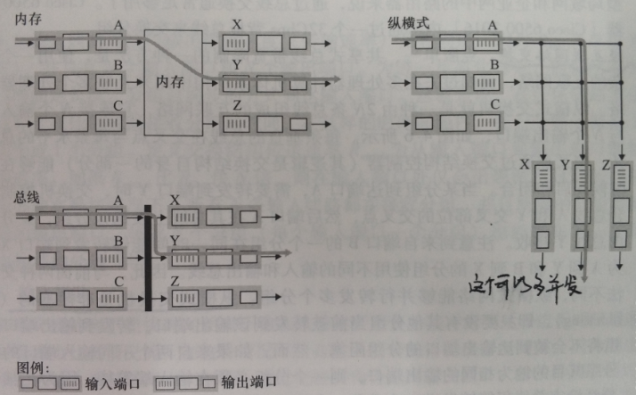
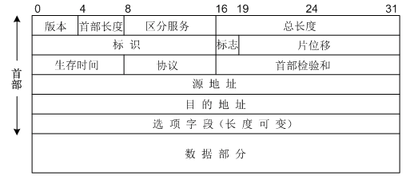
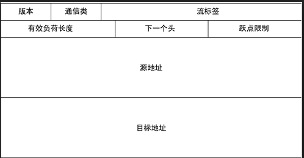
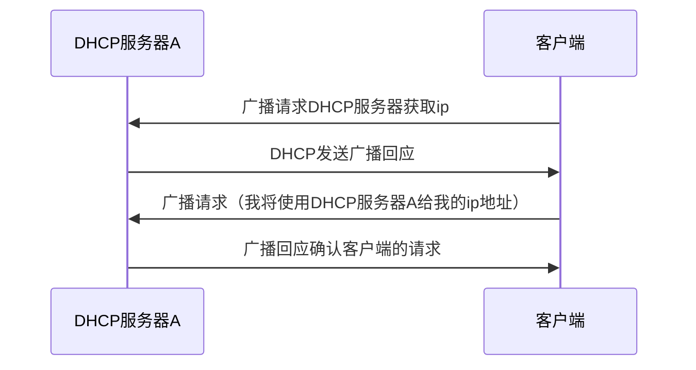

# 计算机网络 第四章 数据平面

网络层最主要2个功能是转发和路由选择：

- 转发：当一个分组到达某路由器的一条输入链路时，该路由器必须将该分组移动到适当的输出链路。
- 路由选择：当分组从发送方流向接收方时，网络层必须决定这些分组所采用的路由或路径。

本章数据平面的主要工作就是转发。

每个路由器都有一个转发表，路由器根据分组目的地前缀与该路由表中的表项进行匹配，找到对应的出口进行转发。

转发主要使用**最长前缀匹配规则**。

而转发主要用到路由器的交换结构，交换结构位于路由器的核心部位。交换主要方式如下：

- 内存交换：由输入端口到内存，然后检索转发表，在从内存复制到对应的输出端口的缓存内。

- 总线交换：输入端口经一根共享总线将分组直接传送到输出端口，不需要路由选择处理器的干预。

  > 单一，总线只有一条，单线运行。当有多个分组同时到达时候，其余分组只能等候。
  >
  > 该方式只能用于小型局域网和企业网的路由器。

- 互联网交换：一种由2N条总线组成的互联网络，连接N个输入端口与N个输出端口，线路是纵横式的。

  > 客服单一、共享式总线带宽限制。能同时并发转发多个分组。

无论怎么样进行交换都可能会出现排队情况，一般有以下三种方式进行排队：

- 先进先出

- 优先权排队

  > 通常由源或目的TCP、UDP端口号来进行分组。如实时话音分组可能获得超过非实时流量的优先权。
  >
  > 同一个队列中的还是采用先进先出的策略。

- 循环加权公平排队

  > 把分组进行分类然后赋予一个权重w，然后调度器循环的在各个类之间进行分组的传输。

## IP协议

网络层最重要的协议就是IP协议了，IP协议又分IPv4和IPv6。

### IPv4

ipv4结构图

> **1、版本**：  长度 4 bit 。标识目前采用的 IP 协议的版本号。一般的值为 0100（IPv4），0110（IPv6）
>
> **2、首部长度**：  长度 4 bit 。 IPv4的首部长度。
>
> **3、区分服务**： 长度 8 bit 。 用来获得更好的服务。只有在使用区分服务时，这个字段才起作用。
>
> **4、总长度**：  长度 16 bit 。指首部和数据之和的长度。
>
> **5、标识**：  长度 16 bit 。该字段和 Flags 和 Fragment Offest 字段联合使用，对较大的上层数据包进行分段（fragment）操作。路由器将一个包拆分后，所有拆分开的小包被标记相同的值，以便目的端设备能够区分哪个包属于被拆分开的包的一部分。
>
> **6、标志**：长度 3 bit 。目前只有两位有意义，第一位不使用。最低位为1表示后面“还有分片”的数据报，为0表示这已经是最后一个数据片；中间一位为1表示“不能分片”，为0才允许分片。
>
> **7、片位移**： 长度 13 bit，以 8 个八位组为单位。表示该 IP 包在该组分片包中位置，接收端靠此来组装还原 IP 包。
>
> **8、生存时间**： 表示数据报在网络中的寿命，英文缩写是TTL（Time To Live），功能是“跳数限制”。
>
> **9、协议**：指出此数据报携带的数据是使用何种协议。
>
> **10、首部检验和**： 数据报每经过一个路由器，路由器都要重新计算一下首部检验和，若首部未发生变化，则此结果必为0，于是就保留这个数据报。这个字段只检验数据报的首部，但不包括数据部分。
>
> **11、源地址**：报文发送方的IPv4地址。
>
> **12、目的地址**：报文接收方的IPv4地址。  
>
> **13、选项字段**：  0～40字节  用来支持排错、测量以及安全等措施。在必要的时候插入值为0的填充字节。这个在ipv6里面被去掉了  
>
> **14、数据部分**：  可变  用来填充报文。

以太网的ipv4数据包能够承载不超过1500字节的数据，但是在传输过程中，有的链路不一定支持这个大小，所以就会把ipv4的数据帧进行拆分，拆成片，然后再发送出去，在接收端再重新把分片重新组装。

每台电脑要上网就必须有一个ip地址（目前已经完全不够用了），多个电脑连接到一个路由器，这中几个主机与1个路由器形成的网络我们叫**子网**。IP编址为这个子网分配一个地址如223.1.1.0/24，其中`/24`这种称做子网掩码，**指示32比特中的最左侧24比特定义了子网地址**。

### IPv6

IPv6的包结构如下：

> **1、版本（Version）：**4 bit，值为 6（二进制值为 0110）表示 IPv6 报文。
>
> **2、通信类别（Traffic Class）：**8 bit，这相当于 IPv4 协议中的 ToS 字段。但是，考虑到 ToS 字段这些年的发展，现在都用来做区分服务等级（Differentiated Class of Service，DiffServ）了。所以，即使这个字段和旧的 ToS 字段有些相似，它们的名字要比所传送的值更能确切地反映目前的用处。
>
> **3、流标签（Flow Label）：**20 bit，IPv6 中新增。流标签可用来标记特定流的报文，以便在网络层区分不同的报文。转发路径上的路由器可以根据流标签来区分流并进行处理。由于流标签在 IPv6 报文头中携带，转发路由器可以不必根据报文内容来识别不同的流，目的节点也同样可以根据流标签识别流，同时由于流标签在报文头中，因此使用 IPSec 后仍然可以根据流标签进行 QoS 处理。
>
> **4、有效载荷长度（Payload Length）：**16 bit，以字节为单位的 IPv6 载荷长度，也就是 IPv6 报文基本头以后部分的长度（包括所有扩展头部分）。IPv4 的总长度字段是 16 位的，但 IPv6 的有效载荷长度字段却是 20 位，这就意味着该字段能够指定更长的有效载荷（1 048 575 字节，相对 IPv4 中只有 65 535 字节）。
>
> **5、下一报头（Next Header）：**8 bit，用来标识当前头（基本头或扩展头）后下一个头的类型。此域内定义的类型与 IPv4 中的协议域值相同。IPv6 定义的扩展头由基本头或扩展头中的扩展头域链接成一条链。这一机制下处理扩展头更高效，转发路由器只处理必须处理的选项头，提高了转发效率。
>
> **6、跳数限制（Hop Limit）：**8 bit，和 IPv4 中的 TTL 字段类似。每个转发此报文的节点把此域减 1，如果此域值减到 0 则丢弃。注意：IPv4 中的 TTL 设计之初是以秒（s）为单位的，但实际使用时跟 IPv6 中的 Hop Limit 一样，是以跳数为单位。
>
> **7、源地址（Source Address）：**128 bit，报文的源地址。
>
> **8、目的地址（Destination Address）：**128 bit，报文的目的地址。

IPv6有64位长度，因此有足够的ip地址分配给全网的客户端使用，但是在IPv4到IPv6的迁移过程是缓慢的，不可能一次升级所有客户端，这是不现实的。在某些网络上IPv6会把自己封装成IPv4，从而可以在不支持IPv6的网络中传输。

## DHCP协议

DHCP协议是用来自动配置ip地址的，一个新主机进入网络时候的配置流程如下：

- **1、DHCP服务器发现**：新来的客户端发送请求到ip为255.255.255.255端口67的地址，并携带自身的MAC地址。这是一个广播地址，该子网内的所有主机都会收到。

  

- **2、DHCP服务器提供**：DHCP服务器收到广播后想客户端做出响应，仍旧是发送广播，携带**发现报文事务ID**，**IP地址**，**网络掩码**以及**地址租用期**这几个数据广播给客户端。

  

- **3、DHCP请求**：客户端收到回应广播后，再次发送一个广播，说我即将使用DHCP服务器A发给我的IP地址，依旧附上自己的MAC地址。子网中可能存在多个DHCP服务器，每个都会对新客户端进行广播回应，一般来说新客户端会使用先到达的回应。

- **4、DCHP ACK回应**：DHCP服务器收到客户端的DHCP请求后就会对其进行回应，表示接受客户端的请求，并将这一IP地址的合法租赁信息广播到本子网所有其他设配。

