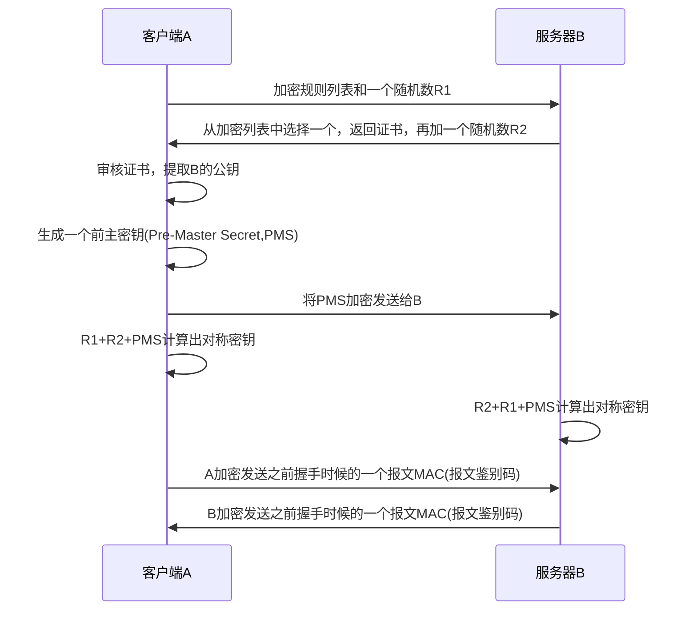

# 计算机网络 第八章 计算机网络中的安全

这一章主要是讲计算机网络中的加密操作。

**对称加密**：加、解密使用的同是一串密钥，所以被称做对称加密。对称加密只有一个密钥作为私钥。 

**非对称加密：**加、解密使用不同的密钥，一把作为公开的公钥，另一把作为私钥。公钥加密的信息，只有私钥才能解密。反之，私钥加密的信息，只有公钥才能解密。 

DES、3DES、RC4、AES等是常用的对称加密。

**RSA算法**是经典的非对称加密算法。

---

**数字签名**是一种类似写在纸上的普通的物理签名，但是使用了公钥加密领域的技术实现，用于鉴别数字信息的方法。

数字签名的一个重要应用是公钥认证，即证实一个公钥是属于某个特定的实体。IPsec和SSL也是公钥认证的应用。公钥认证是通过认证中心(CA)来算出来的，另外**CA认证中心**也需要认证，这时候就需要更牛的CA来进行认证，一直到全球皆知的几大著名CA，做最后的背书。

---

**TCP安全连接，SSL传输过程：**

最后2个步骤可以使握手免受篡改危害。比如在第一步，A提供算法列表给B，如果中间人C截获报文并篡改，把列表中强的算法去掉，迫使B选择一个弱鸡的算法。为了防止这种攻击，在第5步，A加密发送一个之前已经发送过的握手报文的MAC(报文鉴别码)，B就可以比较这个MAC与它已接收和发送的握手报文的MAC，如果有不一致，B就能断开连接。类似B发给A，A同样也能做如此校验。

