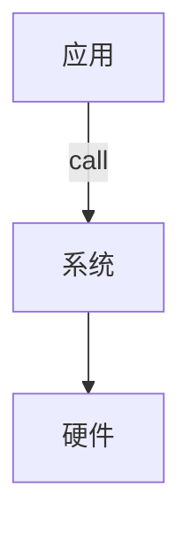

# 深入理解计算机 第一章

一个hello world程序的生命周期

hello.c编译的完整过程

hello.c --> hello.i --> hello.s --> hello.o --> hello.out

信息就是位（字节）+ 上下文（环境变量，上下文的语义）

- 预处理阶段：把 `# include`里面的对应的文件内容插入到程序文本中
- 编译阶段：编译成汇编语言
- 汇编阶段：将汇编语言翻译成机器语言
- 链接阶段：将hello文件中的printf函数对应的预编译好了的文件链接到文件中。

hello程序在硬件中的运行，当我们在shell中输入`./hello`后，主要流程如下

> `./hello`
>
> --> 将hello字符串读入寄存器 
>
> -->  再存到内存 
>
> --> 按下Enter（回车）
>
> --> 将hello文件代码和数据从磁盘复制到主存 
>
> --> 处理器执行hello里的main程序中的机器指令 
>
> --> 指令将 `hello world\n` 字符串从主存复制到寄存器文件 
>
> --> 寄存器文件复制到显示设备最终显示。

从上面看出很多时间是浪费在从一个设备复制到另外一个设备，所以高速缓存就非常重要了。

计算机的软硬件层级结构如下：

操作系统有2个基本功能：

- 防止硬件被失控的应用程序滥用
- 向应用程序提供简单一致的机制来控制复杂而又通常大不相同的低级硬件设备

操作系统又通过进程、虚拟内存和文件这几个抽象概念来实现上面的两个功能。

- 进程：是操作系统对一个正在运行的程序的一种抽象。是对正在运行的程序过程的抽象。
- 虚拟内存：为每个进程提供一种假象，好像每个进程都在单独的使用主存。每个进程看到的内存都是一致的，称为虚拟地址空间。
- 文件：文件就是字节序列。每个I/O设备，包括磁盘、键盘、显示器甚至网络，都可以看做是文件。

这一章主要是计算机的漫游，粗略理解计算机，我觉的有以下三个问题需要重点理解

1、程序如何被理解？

> 字符代码被最终被转成计算机指令，再被cpu执行

2、程序在硬件之间的数据如何流转？（这个在文中已经有体现）

3、计算机系统抽象概念的理解？

> 计算机把硬件抽象成各种接口，向上（应用层）提供统一的接口调用，向下兼容各种不同的硬件。这种思想很重要，在软件开发中也是非常常见和重要的一种。