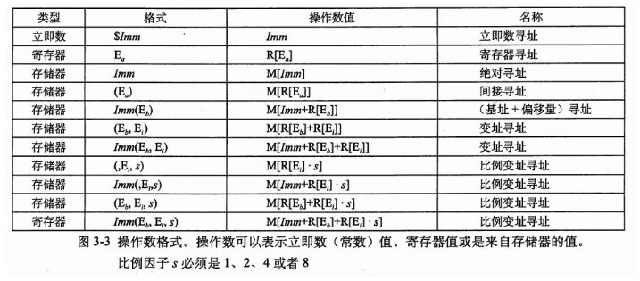
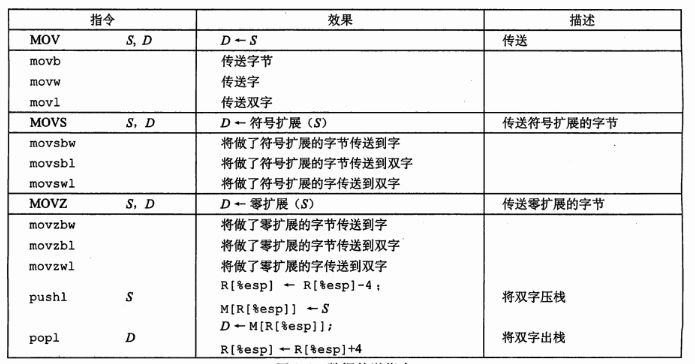
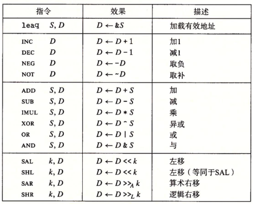

# 深入理解计算机第三章

这一章主要是介绍c语言编写的程序，经过编译后变成汇编语言，再是介绍汇编语言的一些特性，了解汇编语言能更好的理解计算机，更好的调配计算机资源。


机器级程序使用的地址是虚拟地址，提供的存储器模型看上去是一个非常大的数组，但实际上存储器系统的实现是将多个硬件存储器和软件结合起来的。

计算机执行*机器代码*，通过字节序列编码低级的操作，包括处理数据、管理内存、读取存储设备上的数据，以及网络通信


对于机器级编程而言，有两个抽象极为重要：

- 指令集架构（Instruction Set Architecure）定义机器级程序的格式和行为
- 机器级程序使用的内存地址是虚拟地址


机器执行的程序只是对一系列指令进行编码的字节序列，机器对这些指令的源代码几乎一无所知


学习底层实现的意义：

> 精通细节是理解更深和更基本概念的先决条件


操作数分为三种：

- 立即数，用来表示常数值，如`$1`
- 寄存器，表示某个寄存器的内容，如`%eax`
- 内存引用，根据计算出的地址访问某个内存位置

寻址模式



寻址的模式,最通用的模式是

```
计算出的内存地址 = 立即数偏移量 + 基址寄存器 + 变址寄存器 * 比例因子s
```

其中s可能为1,2,4或8.


数据传输



熟悉汇编在移动复制数据时候的操作


## 算术和逻辑操作

算术和逻辑操作类指令分四类：加载有效地址，一元操作，二元操作和移位，如下



- leaq指令实际上是movq指令的变形。将有效地址写入到目的操作数。

  例子： leaq 7(%rdx,%rdx,4),%rax　　　　

  若%rdx的值为x,则最后%rax的值为5x+7,而不是以5x+7为地址，在内存中寻址得到的操作数

- 第二组中的是一元操作，只有一个操作数，即是源又是目的。

- 第三组中的是二元操作，其中，第二个操作数即是源又是目的。第一个操作数可以为立即数、寄存器或内存位置，第二个操作数可以为寄存器或内存位置。

- 第四组是移位操作，第一个操作数是移位量，它可以是立即数或存放在%cl中，第二个操作数是要移位的数，可以是寄存器或者内存位置。

特别的：imull，mull可以是一元操作（上面的二元操作）。divl和idivl是除法。cltd是符号扩展。这5个是特殊的算术操作。


## 数组的分配和访问

x86-64的内存引用指令可以用来简化数组访问，指令：

```
movl (%rdx, %rcx, 4), %eax
```

%rdx放置数组第一元素的地址，%rcx是数组元素的个数，4是数组元素的字长。正好对应。

允许的伸缩因子1,2,4,8覆盖了所有基本简单数据类型的大小。

**嵌套的数组**

数组`D[i][j]`的内存地址为`&D[i][j]=D+L(C*i+j)`，C是一维的个数


**对抗缓冲区溢出攻击**：

- 栈随机化（栈的位置在程序每次运行时都有变化）在linux系统中，栈随机化已经变成了标准行为。这可以加大攻击一个系统的难度，但总是可以暴力破解的。是一个相乘的关系，空操作雪橇是一段nop，当程序运行时，如果返回地址被篡改到这一部分中，那么着一部分会划过，然后到达攻击代码，程序运行次数乘上nop的个数，如果大于随机地址的范围，总能暴力破解掉。
- 栈破坏检测——栈保护者，金丝雀值（哨兵值）。
- 限制可执行代码区域——消除攻击者向系统中插入可执行代码的能力。是否能将代码限制在由编译器在创建原始程序时产生的那个部分中，取决于语言和操作系统。