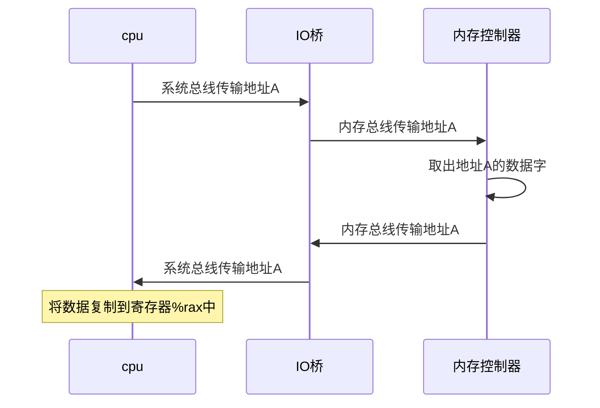
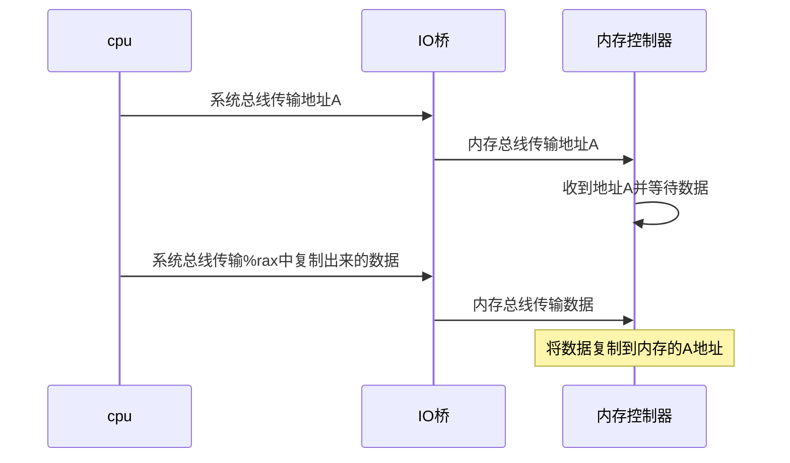

# 第六章存储器的层级结构
存储技术，计算机是如何存储的

cpu执行以下操作时候的流程：
movq A,%rax



那反过来执行：`movq  %rax,A`
cpu执行写事务，寄存器%rax的内容被写到地址A


总线携带的信号会同步事务，并标识出当前正在被执行的事务类型。


磁盘容量由以下决定：

-  记录密度：磁道一英寸的段中可以放入的位数
-  磁道密度：从盘片中心出发半径上一英寸的段内可以有的磁道数
-  面密度：记录密度和磁道密度的乘积


局部性原则：

- 重复引用相同变量的程序具有良好的时间局部性
- 对于有步长为k的引用模式的程序，步长越小，空间局部性越好。在内存中大步长跳来跳去的程序空间局部性差
- 对于取指令来说，循环具有好的时间和空间局部性。循环体越小，循环迭代次数越多，局部性越好。

如何辨别一段程序的空间局部性好？
看其在访问内存数据时候是否是连续访问的。

```python
class Point():
    def __init__(self):
        self.vel = []
        self.acc = []


def init_point(n):
    pl = []
    for i in range(0,3):
        p = Point()
        p.vel = [1 for i in range(0, n)]
        p.acc = [1 for i in range(0, n)]
        pl.append(p)
    return pl


def clear1(pl, n):
    for i in range(0, len(pl)):
        for j in range(0, n):
            pl[i].vel[j] = 0
        for j in range(0, n):
            pl[i].acc[j] = 0

def clear2(pl,n):
    for i in range(0, len(pl)):
        for j in range(0, n):
            pl[i].vel[j] = 0
            pl[i].acc[j] = 0

def clear3(pl, n):
    for j in range(0, n):
        for i in range(0, len(pl)):
            pl[i].vel[j] = 0
        for i in range(0, len(pl)):
            pl[i].acc[j] = 0

```

比如上面代码中，空间局部性的排序就是clear1>clear2>clear3