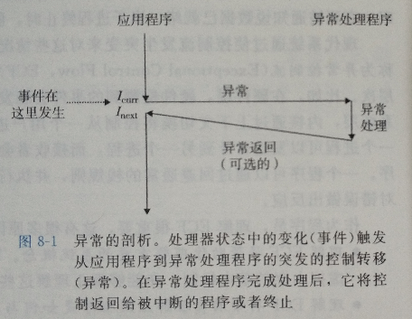

# 异常控制流

## 异常

异常是异常控制流的一种形式，它一部分由硬件实现，一部分由操作系统实现。

异常的流程



处理器检测到有事件发生时，它就会通过一张异常表的跳转表，进行一个间接过程调用(异常)，跳到专门处理这类事件的异常处理程序。异常处理完后，根据引起异常事件的类型，会发生一下3种情况中的一种：

- 1、处理程序将控制返回给当前指令 I<sub>curr</sub> ，即当事件发生时正在执行的指令
- 2、返回给 I<sub>next</sub> ，如果没有发生异常将会执行下一条指令
- 3、处理程序终止被中断的程序


异常的类别

- 中断
- 陷阱
- 故障
- 终止


## 进程

进程就是一个执行中程序的实例。

进程提供给应用程序2个非常重要的抽象：

- 一个独立的逻辑控制流，一个好像我们的程序独占地使用处理器的假象。
- 一个私有的地址空间，一个好像我们的程序独占地使用内存系统的假象。


**用户模式和内核模式**（限制可执行的指令以及访问的地址空间范围）

> 处理器通常是用某个控制寄存器中的一个模式位来描述进程当前享有的特权
>
> - 设置了模式位说明进程运行在内核模式
> - 没有设置模式位说明是用户模式


**上下文的切换**

内核为每个进程维持一个上下文(context)。上下文就是重新启动一个被抢占的进程所需的状态。包括通用目的寄存器、浮点寄存器、程序计数器、用户栈、状态寄存器、内核栈和各种内核数据结构。

切换流程：

- 1、保存当前进程的上下文
- 2、恢复某个先前被抢占的进程被保存的上下文
- 3、将控制传递给这个新恢复的进程


## 进程控制

从程序员的角度,可以认为进程总是处于下面3种状态之一:

- 1、**运行**.要么在cpu上执行,要么在等待被执行且最终会被内核调度
- 2、**停止**.进程的执行被挂起(suspend),且不会被调度.当收到SIGSTOP,SIGTSTP,SIDTTIN或者SIGTTOU信号时,进程就停止,并且保持 停止直到它收到一个SIGCONT信号,在这个时刻,进程再次开始运行.(相当于linux命令中的ctrl+z,ctrl+z的是将任务中断,但是此 任务并没有结束,他仍然在进程中他只是维持挂起的状态.)
- 3、**终止**.进程永远停止了.进程会因为3种原因终止:
  - 1)收到一个信号,该信号的默认行为是终止进程,
  - 2)从主程序返回,
  - 3)调用exit函 数


父进程通过调用fork函数创建一个新的运行子进程

```
pid_t fork(void)
```

新创建的子进程几乎但不完全与父进程相同。子进程得到与父进程用户级虚拟地址空间相同的(但是独立的)一份副本，包括代码和数据段、堆、共享库以及调用栈。子进程还获得与父进程任何 打开文件描述符相同的副本，这就意味着当父进程调用fork时，子进程可以读写父进程中打开的任何文件。父进程和新创建的子进程 之间最大的区别在于它们有不同的pid。

frok函数只被调用1次却会返回2次，一次是在调用进程(父进程)中，一次是在新创建的子进程中。在父进程中，fork返回子进程的pid，在子进程中，fork返回0。因为子进程的PID总是为非零，返回值就提供一个明确的方法来分辨程序是在父进程还是在子进程中执行。

