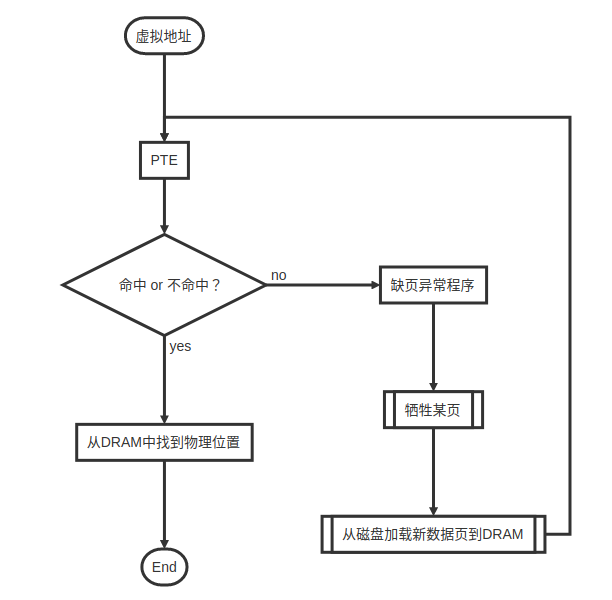

# 第九章 虚拟内存

计算机通过虚拟内存间接访问内存，为什么要这样做呢？

因为我们在编译程序的时候编译器就对于某些变量和函数进行了内存地址的指定，如果是直接指定物理内存地址，则完全不现实，因为你程序只有在加载时候才能真正知道自己被加载到内存哪个位置，真实物理地址是不确定的。而采用虚拟内存，则程序编译时候所有地址都是逻辑地址，真正加载时候计算机会把逻辑地址翻译成物理地址。

每个进程都有一个单独的虚拟内存地址，所以这给程序员节省了很多事，从逻辑上看来，当前进程就好像单独在使用所有内存地址一样。

一个使用虚拟地址寻址的系统：

```mermaid
sequenceDiagram
            participant A  as cpu
            participant B as MMU(地址翻译)
            participant C as 主存

            A->>B: 虚拟地址（VA）
            B->>C: 物理地址（PA）
            C->>A: 数据字

```

计算机翻译虚拟内存的流程大致如下：

PTE（page table entry）页表条目，页表将虚拟页映射到物理页。

虚拟内存简化了链接和加载、代码和数据共享，以及程序的内存分配：

- 简化链接：独立的地址空间允许每个进程的内存映像使用相同的基本格式
- 简化加载：虚拟内存还使得容易向内存中加载可执行文件和共享对象文件
- 简化共享：独立地址空间为操作系统提供了一个管理用户进程和操作系统自身之间共享的一致机制。
- 简化内存分配：虚拟内存为向用户进程提供一个简单的分配额外内存的机制

