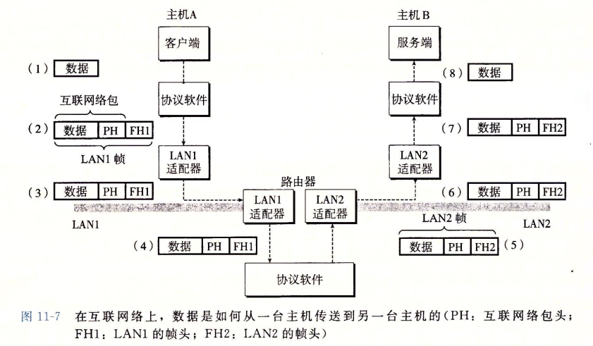

# 深入理解计算机第11章

## 客户端-服务器编程模型

客户端和服务器都只是一个进程，一台主机上可以运行许多个不同的客户端和服务器。


## 网络

组成：以太网，网桥，路由器

通信方式：命名机制（ip地址），传送机制（TCP/IP，UDP等）

信息传送过程如下图所示：




## IP因特网

每台主机都实现了TCP/IP协议，因特网可以看做一个世界范围的主机集合，有如下特征

- 主机集合被映射为一组32位的IP地址
- 这组IP地址被映射为一组称为因特网域名(Internet domain name)的标识符
- 因特网主机上的进程能够通过连接和任何其他因特网上的主机进行通信。


ip地址通常是以一种成为点分十进制表示法来表示

域名是更加人性化的一种设计，一个域名可以映射一个ip地址，也可以映射多个ip地址

因特网的连接是通过“地址:端口“来指定连接的。


## 套接字

套接字接口是一组函数，他们和Unix I/O函数结合起来，用以创建网络应用

从Linux内核角度看，一个套接字就是通信的一个端点。从Linux程序角度看，套接字就是一个有相应描述符的打开文件。

客户端和服务器**使用socket函数来创建一个套接字**描述符

```c
#include <sys/types.h>
#include <sys/socket.h>

int socket(int domain, int type, int protocol);
```

客户端通过调用**connect函数来建立和服务器的连接**。

```c
#include <sys/socket.h>

int connect(int clientfd, const struct sockaddr *addr, socklen_t addrlen);
```

connect函数会阻塞，一直到连接成功建立或是发生错误。如果成功，clientfd描述符现在就准备好可以读写了。

服务器使用bind函数来告诉内核将addr中的服务器套接字地址和套接字描述符sockfd联系起来

```c
#include <sys/socket.h>
int bind(int sockfd, const struct sockaddr *addr, socklen_t addrlen);
```

服务器**使用listen函数监听**某个端口

```c
#include <sys/socket.h>
int listen(int sockfd, int backlog);
```

listen函数将sockfd从一个主从套接字转化为一个监听套接字，该套接字可以接受来自客户端的连接请求。

服务器通过**调用accept函数来等待**来自客户端的连接请求。

```c
#include <sys/socket.h>
int accept(int listenfd, struct socaddr *addr, int *addrlen);
```

accept函数等待来自客户端的连接请求到达侦听描述符listenfd，然后在addr中填写客户端的套接字地址，并返回一个已连接的描述符，这个描述符可以被用来利用Unix I/O函数与客户端通信。


## web服务器

web服务器使用http协议进行交互。

每个web服务器返回的内容都是和它管理的某个文件相关联的。服务器通过URL(通用资源定位符)来指定文件的位置。

URL后缀的几点理解：

- 确定一个URL指向的是静态内容还是动态内容没有标准的规则。
- 后缀中的最开始的那个“/”不表示Linux的根目录。相反，它表示的是被请求内容类型的主目录。
- 最小的URL后缀是“/”字符，所有服务器将其扩展为某个默认的主页，例如/index。


解析参数：get方式通过url传递参数，post通过请求体传递参数。

服务器在收到一个请求如`GET /cgi-bin/adder?15000&213 HTTP/1.1`时候，它通过fork来创建一个子进程，并调用execve在子进程的上下文中执行/cgi-bin/adder程序。在调用execve之前，子进程将CGI环境变量QUERY_STRING设置为 ”15000&213“，adder程序在运行时候可以用LInux getenv函数来引用它。

CGI定义了大量的其他环境变量，一个CGI程序在它运行时可以设置这些环境变量。

一个CGI程序将它的动态内容发送到标准输出。在子进程加载并运行CGI程序之前，它使用linux dup2函数将标准输出重定向到和客户端相关联的已连接描述符。


## 总结

- 每个网络应用都是基于客户端-服务器模型的。

- 客户端和服务器通过因特网来通信。

- 客户端和服务器通过使用套接字接口建立连接。

- web服务器使用HTTP协议和他们的客户端彼此通信。

此章节我们了解到一个web服务的基本雏形，从网络的构成，网络的通信以及通过一个web应用的建立中大概的讲解了整个流程。网络通信的本质还就是进程间的通信（使用套接字进行通信），只不过现在变成了远程的进程通信，它们之间通过既定的协议来进行统一的通信交流。